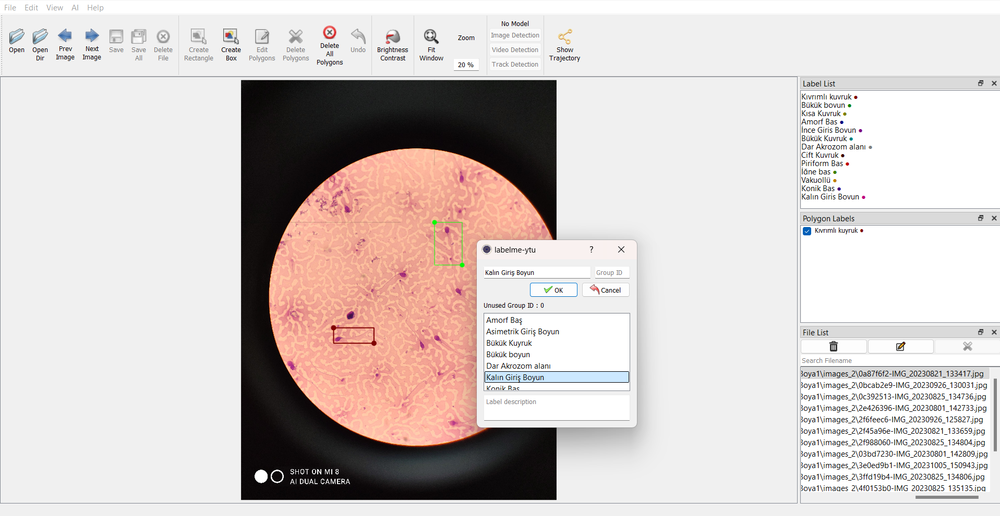
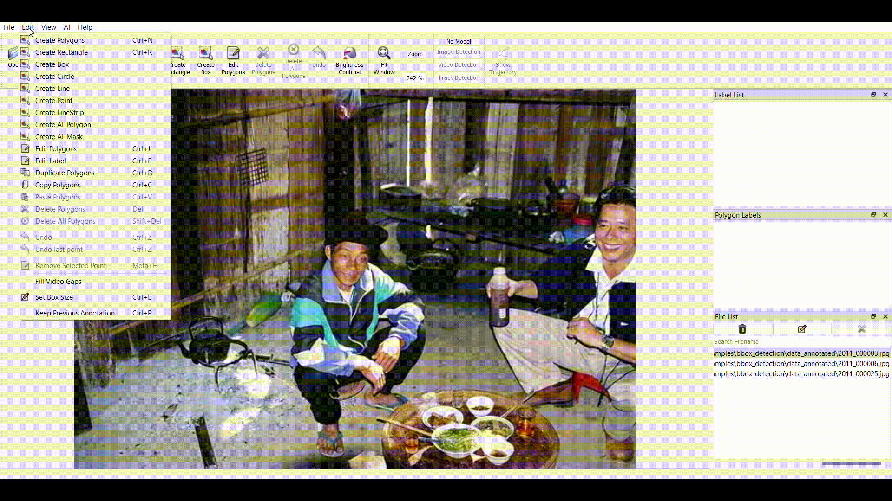
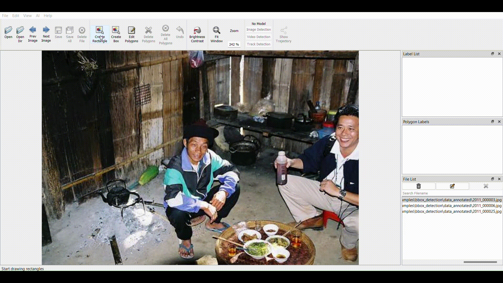
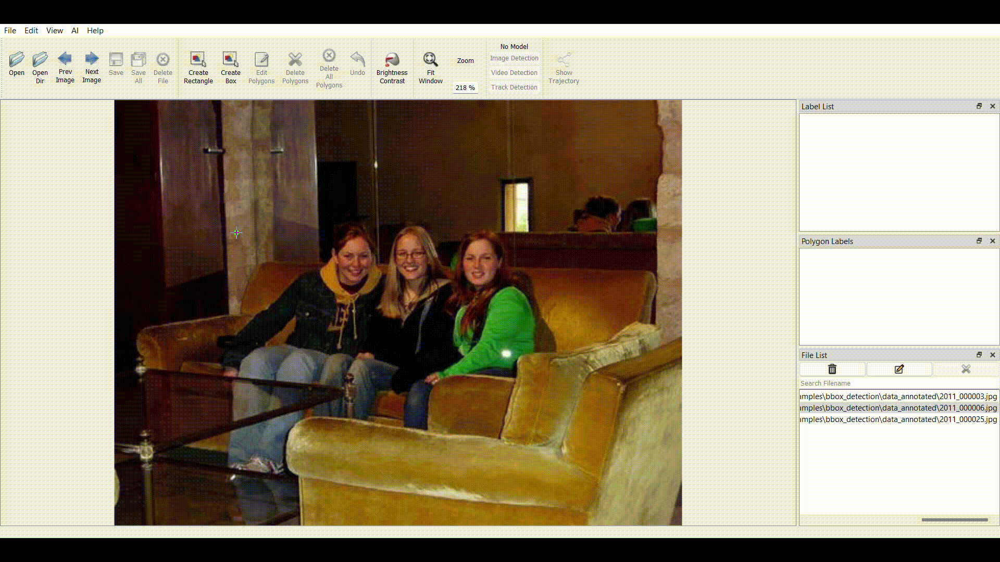
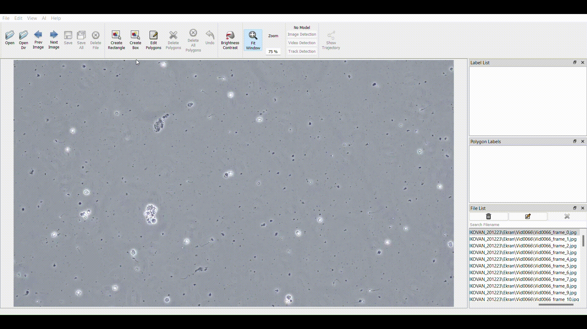
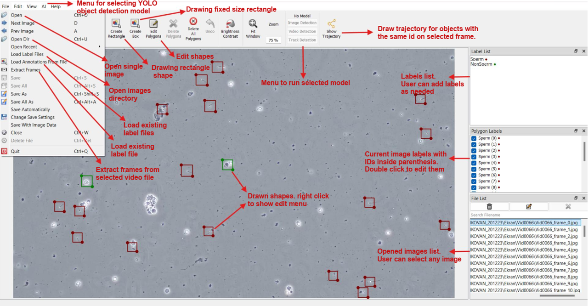

<h1 align="center">
  <br/>labelme-ytu
</h1>

<h4 align="center">
  AI Powered Image and Video Annotation Tool
</h4>

<div align="center">
    <a href="https://pypi.org/project/labelme-ytu"></a>
    <a href="https://pypi.org/project/labelme"></a>
</div>

<div align="center">
  <a href="#installation"><b>Installation</b></a>
  | <a href="#features"><b>Features</b></a>
</div>

<br/>

<div align="center">
  
</div>

## Description

Labelme-ytu is an AI powered graphical image and video annotation tool built on the top of <a href="https://github.com/wkentaro/labelme">Labelme Package</a>. It is written in Python and uses Qt for its graphical user interface.

    
<br/>
<i>Various primitives (polygon, rectangle, circle, line, point and box).</i>


## Features

<div align="center">
  
</div>

- [x] Image annotation for polygon, rectangle, box (fixed size rectangle), circle, line and point.
- [x] single image and multiple images annotation.
- [x] Video annotation by extracting frames from video file with specific frame rate (FPS).
- [x] Loading label files with three supported formats: labelme (default format), YOLO and label studio formats.
- [x] AI integration feature by selecting YOLO models (*.pt) for automatically annotation. Running the model on single image or multiple images. In addition to run it to track objects across mulitple frames.
- [x] Saving annotations with two supported formats: labelme and YOLO formats.
- [x] Fill video gap feature by automatically drawing shapes (with same ids) between two selected frames.
- [x] Drawing trajectory for video frames annotation. (objects with the same ID)
- [x] Save single file and multiple files. In addition to auto save and save as options.


## Installation

There are 2 options to install labelme-ytu:

### Option 1: Using pip

```bash
pip install labelme-ytu
```

### Option 2:
You can download application's source code files from <a href="https://github.com/Esam-HM/labelme-ytu">Here</a> and run them on your favorite python IDE.
#### Steps:
1) Ensure that Python version 3 or higher is installed on your system. If not install it.
2) Ensure that you can run python codes on your IDE.
3) Ensure that you have latest version of pip installed. If not upgrade it using the command below:
```bash
pip python -m pip install --upgrade pip
```
4) Download source code from this github page <a href="https://github.com/Esam-HM/labelme-ytu">Here</a>. Create new directory and extract all files downloaded to the new created directory. Then, open the directory in your IDE.
5) To install the libraries required for the source code to run, run the following command from terminal:
```bash
python setup.py
```
6) After installation completed. Run the following command to open the application GUI:
```bash
python -m labelme-ytu
```

## Authors

© All rights reserved to Yıldız Technical University, Computer Engineering Department.